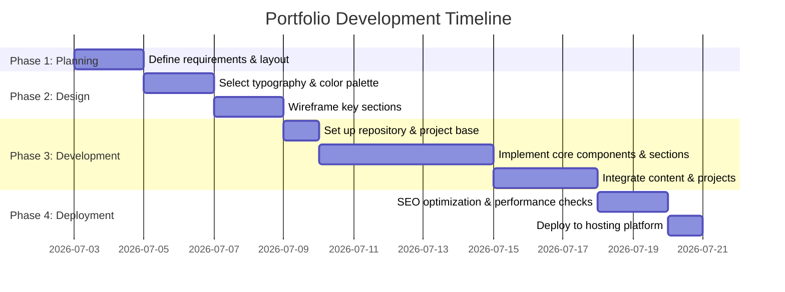

This document outlines the strategic plan for designing, developing, and deploying a personal professional portfolio website.

## 1. Project Objectives
* Showcase technical projects and professional experience.
* Provide an easy channel for recruiters and potential clients to contact.
* Demonstrate proficiency in modern web development practices.

## 2. Target Audience
* Technical recruiters looking for specific skills.
* Engineering managers assessing code quality and project execution.
* Potential freelance clients seeking development services.

## 3. Selected Technology Stack
* **Framework:** Next.js (App Router)
* **Database:** MySQL
* **ORM / Database Tool:** Prisma or Drizzle ORM (for type-safe database queries)
* **Styling:** CSS Modules or Tailwind CSS
* **Hosting:** Vercel (for Next.js frontend and serverless API endpoints)
* **Database Hosting:** PlanetScale, Aiven, or a self-hosted MySQL instance

## 4. Key Sections
* **Hero Section:** Clear value proposition, professional title, and brief summary.
* **About Me:** Professional background, core philosophy, and technical stack logos/badges.
* **Projects Gallery:** Cards showcasing projects with:
  * Title and description
  * Technologies used
  * Links to source code (GitHub) and live demos
* **Experience / Resume:** Chronological employment history and notable achievements.
* **Contact:** Professional contact form or direct links to Email, GitHub, and LinkedIn.

## 5. Development Phases

## 6. Next Actions
- [ ] Finalize technology stack.
- [ ] Gather assets (headshot, project descriptions, links).
- [ ] Select color palette and typography.
